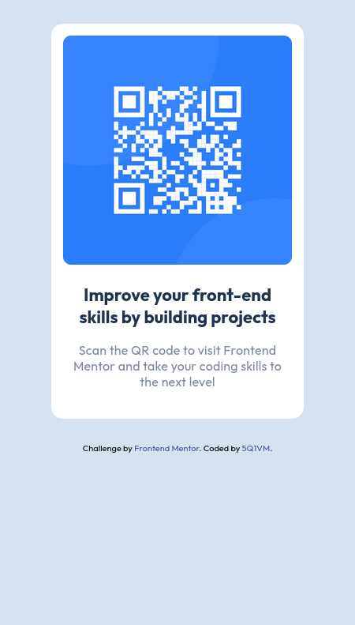

# Frontend Mentor - QR code component solution

This is a solution to the [QR code component challenge on Frontend Mentor](https://www.frontendmentor.io/challenges/qr-code-component-iux_sIO_H). Frontend Mentor challenges help you improve your coding skills by building realistic projects. 

## Table of contents

- [Overview](#overview)
  - [Screenshot](#screenshot)
  - [Links](#links)
- [My process](#my-process)
  - [Built with](#built-with)
  - [What I learned](#what-i-learned)
  - [Continued development](#continued-development)
  - [Useful resources](#useful-resources)
- [Author](#author)

## Overview

### Screenshot

### Links

- Solution URL: [Solution](https://github.com/5Q1VM5bgef/front-end-mentor-qr-code-component-challenge)
- Live Site URL: [Live site URL](https://5q1vm5bgef.github.io/front-end-mentor-qr-code-component-challenge/)

## My process

### Built with

- Semantic HTML5 markup
- CSS custom properties
- Flexbox
- Mobile-first workflow

### What I learned

Figured out that responsive design comes into play when the page has more than one coponent.

### Continued development

I realised that the most basic components of a page don't need to be responsive. What needs to be responsive is a behavior of **several** components.

Looking forwars for the challanges that will consist of several of such smaller cards/components that will need to be positioned responsively.

Since it was my first project, I decided to go easy on myself and use `px` instead of `rem` values. I'm looking forward to use `rem` values in my future projects.

### Useful resources

- [CSS Tutorial – Full Course for Beginners](https://www.youtube.com/watch?v=OXGznpKZ_sA) - 
I had to refresh my knowledge on how to load a font to the project and letter-spacing property in css.

## Author

- Frontend Mentor - [@5Q1VM](https://www.frontendmentor.io/profile/5Q1VM5bgef)

